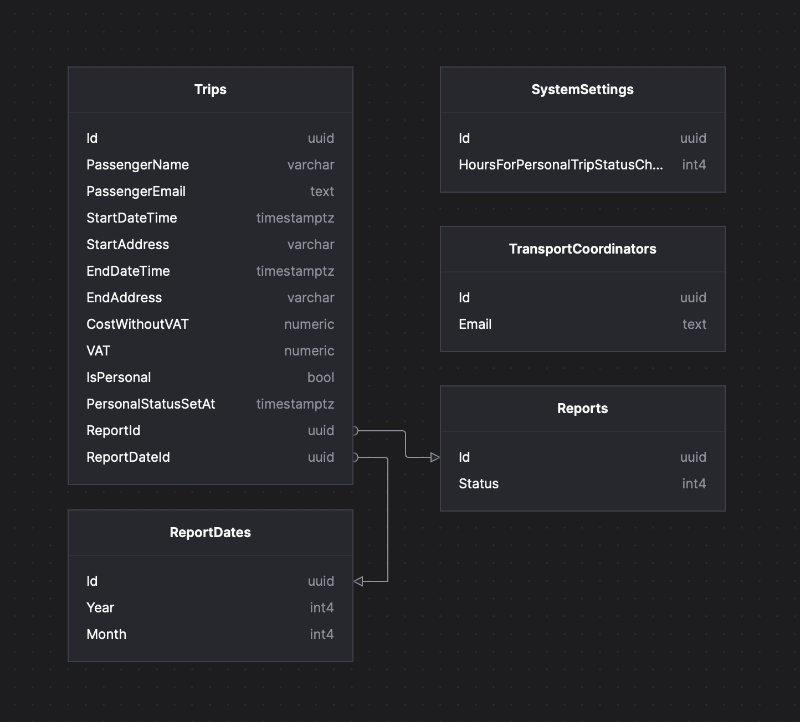

# RideManager
Разработка приложения для автоматизации процесса согласования отчетов об использовании корпоративного такси.

## Технологии
- База данных: PostgreSQL
- Backend: C#, ASP.NET 8.0, Entity Framework
- Дополнительно: OpenXML SDK, Docker, DependencyInjection, JwtBearer, Swagger

## Использование
Перед использованием необходимо установить Docker для создание базы данных. Далее в корне проекта ввести команду:
```sh
$ docker-compose up
```

В базе данных изначально есть тестовые данные для координатора: email – admin@gmail.com.
Далее необходимо запусть Program.cs. Посмотреть список всех api-запросов – Swagger: localhost/swagger/index.html.

## Схема базы данных



## Предметная область

Компания «Х» на ежемесячной основе осуществляет процесс согласования отчётов об использовании сервиса корпоративного такси. Координатор транспортного отдела загружает в систему Excel-файл с единственным листом, который содержит данные о поездках, совершенных сотрудниками в отчётном периоде (месяц и год). Образец файла прилагается. Порядок столбцов неизменен из месяца в месяц, данные всегда начинаются на строке номер 2. 

Если импорт файла завершился успешно, система создаёт записи о поездках. Если случились ошибки – информирует об этом пользователя. После успешного импорта файла координатор получает возможность создать отчёты о поездках. Отчёт о поездках создаётся в отчётном периоде для каждого пассажира такси. Отчёты создаются в статусе «новый». После создания отчётов система направляет их пассажирам. 

Пассажиры имеют возможность отметить любую поездку как личную (нерабочую). При этом отметка может быть снята в течение N часов после её простановки (N устанавливается в настройках приложения).  

По завершении обработки поездок, включенных в отчёт, пассажир присваивает отчёту статус «закрыт». 

Транспортный координатор имеет возможность выгружать информационные отчёты установленного образца. При этом любой информационный отчёт включает в себя только поездки из отчётов в статусе «закрыт». 
